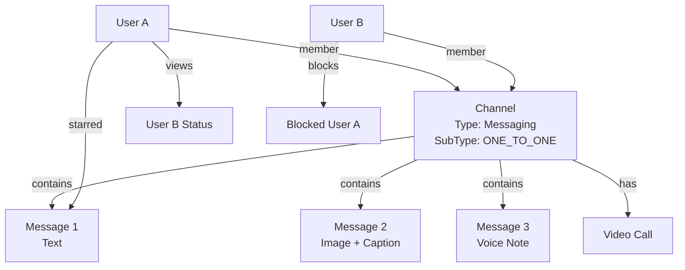
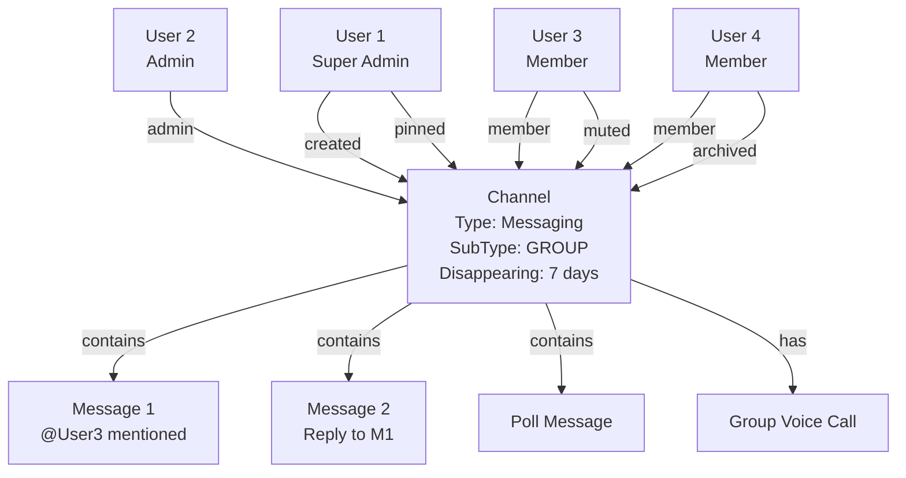
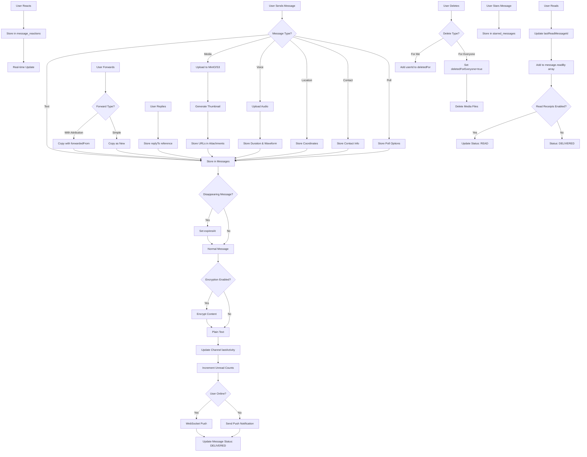

# Messaging App Data Model (WhatsApp-like Features)

## Entity Relationship Diagram

```mermaid
erDiagram
    CHANNELS ||--o{ CHANNEL_MEMBERS : "has"
    CHANNELS ||--o{ MESSAGES : "contains"
    CHANNELS ||--o{ CALLS : "has"
    MESSAGES ||--o{ MESSAGE_REACTIONS : "receives"
    MEDIA ||--o{ MESSAGE_REACTIONS : "receives"
    MESSAGES ||--o| MESSAGES : "replies to"
    MESSAGES ||--o{ STARRED_MESSAGES : "starred by"
    MESSAGES ||--o{ USER_MESSAGE_RELATION : "visible to"
    USER ||--o{ CHANNEL_MEMBERS : "participates"
    USER ||--o{ MESSAGES : "sends"
    USER ||--o{ MESSAGE_REACTIONS : "reacts"
    USER ||--o{ STARRED_MESSAGES : "stars"
    USER ||--o{ USER_MESSAGE_RELATION : "has"
    USER ||--o{ STATUS_UPDATES : "posts"
    USER ||--o{ STATUS_VIEWS : "views"
    USER ||--o{ CONTACTS : "has"
    USER ||--o{ USER_PRESENCE : "has"
    USER ||--o{ MEDIA : "uploads"
    MESSAGES ||--o{ MEDIA : "contains"
    STATUS_UPDATES ||--o{ MEDIA : "contains"
    CHANNELS ||--o{ MEDIA : "has"
    STATUS_UPDATES ||--o{ STATUS_VIEWS : "has"

    CHANNELS {
        String Id PK
        String type "Messaging, Video, Audio, Blog"
        String subType "ONE_TO_ONE or GROUP"
        String visibility "PUBLIC, PRIVATE, PROTECTED"
        String subscriptionType "FREE, MONTHLY_SUBSCRIPTION, DAILY_SUBSCRIPTION, PAY_PER_VIEW"
        String name "Channel name (for groups/channels)"
        String description "Channel description"
        String avatarMediaId FK "Reference to MEDIA collection for channel avatar"
        Date lastActivityAt "Last message/post/content time"
        String lastActivityText "Preview text"
        String lastActivityType "TEXT, IMAGE, VIDEO, etc"
        Boolean isActive
        Array admins "User IDs with admin rights"
        Object channelSettings "Detailed channel settings"
        Boolean disappearingMessages "Enable auto-delete (for Messaging)"
        Integer disappearingMessagesDuration "Seconds before auto-delete"
        Array participantIds "Quick access to all members"
        Integer totalMembers "Cache member count"
        Boolean isArchived "Archived status"
        String crUser FK "User ID who created"
        Date crDate "Creation timestamp"
        String modUser FK "User ID who last modified"
        Date modDate "Last modification timestamp"
    }
    
    CHANNEL_SETTINGS {
        Boolean onlyAdminsCanPost "Restrict posting content"
        Boolean onlyAdminsCanEdit "Edit channel info"
        Boolean membersCanAddOthers "Add participants"
        Boolean postPermission "All can post"
        Boolean approveNewMembers "Admin approval required"
        String whoCanSeeMembers "EVERYONE or ADMINS"
        Boolean allowComments "Enable comments (Video/Audio/Blog)"
        Boolean allowLikes "Enable likes/reactions"
    }

    CHANNEL_MEMBERS {
        String Id PK
        String channelId FK
        String userId FK
        String role "ADMIN, MEMBER, SUPER_ADMIN"
        Date validFrom "Membership start date"
        Date validTo "Membership end date (null if active)"
        String lastReadMessageId FK "For Messaging channels"
        Date lastReadAt
        Integer unreadCount "Cached unread items"
        Boolean isMuted
        Date mutedUntil "Mute expiry time"
        Boolean isPinned
        Integer pinOrder "Pin position"
        Boolean isHidden "Hidden from channel list"
        Boolean isArchived "Archived for this user"
        String addedBy FK "User ID who added"
        String removedBy FK "User ID who removed"
        Array customNotificationSettings
        Boolean receiveNotifications
        String notificationSound "Custom sound"
        String crUser FK "User ID who created"
        Date crDate "Creation timestamp"
        String modUser FK "User ID who last modified"
        Date modDate "Last modification timestamp"
    }

    MESSAGES {
        String Id PK
        String channelId FK
        String senderId FK
        String senderName "Cache sender name"
        String messageType "TEXT, IMAGE, VIDEO, AUDIO, VOICE, DOCUMENT, LOCATION, CONTACT, STICKER, GIF, POLL, SYSTEM"
        String content "Text content or caption"
        Array mediaIds FK "References to MEDIA collection"
        Object location "Lat, long, address"
        Array contacts "Shared contacts"
        Object poll "Poll data"
        Object replyTo "Referenced message"
        Object forwardedFrom "Forward metadata"
        Array mentions "Tagged users @user"
        Boolean isEdited
        Date editedAt
        Boolean deletedForEveryone
        Date deletedAt
        String deletedBy "User who deleted for everyone"
        Boolean isEncrypted "Encrypted with backend system key"
        String encryptionVersion "Backend encryption algorithm version"
        Object metadata "Additional data"
        Date expiresAt "For disappearing messages"
        String crUser FK "User ID who created"
        Date crDate "Creation timestamp"
        String modUser FK "User ID who last modified"
        Date modDate "Last modification timestamp"
    }
    
    USER_MESSAGE_RELATION {
        String Id PK
        String userId FK
        String channelId FK
        String messageId FK
        Boolean isVisible "Can user see this message"
        Boolean isDeleted "Deleted for this user"
        Date deletedAt "When user deleted"
        String deliveryStatus "SENT, DELIVERED, READ"
        Date deliveredAt
        Date readAt
        Boolean isStarred
        Date starredAt
        String crUser FK "User ID who created"
        Date crDate "Creation timestamp"
        String modUser FK "User ID who last modified"
        Date modDate "Last modification timestamp"
    }
    
    MEDIA {
        String Id PK
        String entityType "MESSAGE, USER_PROFILE, CHANNEL_AVATAR, STATUS, CALL"
        String entityId FK "ID of related entity (messageId, userId, channelId, statusId)"
        String uploadedBy FK "User ID who uploaded"
        String type "IMAGE, VIDEO, AUDIO, DOCUMENT, VOICE, PROFILE_IMAGE, THUMBNAIL"
        Integer sequence "Display order for multiple attachments (0, 1, 2...)"
        String fileName
        Long fileSize "Bytes"
        String mimeType
        Integer duration "For audio/video in seconds"
        Integer width "For images/videos"
        Integer height "For images/videos"
        String caption
        Date uploadedAt
        String s3Bucket "S3 bucket name"
        String s3Region "AWS region"
        String s3Key "Object key/path in S3"
        String s3VersionId "S3 version ID (if versioning enabled)"
        String storageClass "STANDARD, INTELLIGENT_TIERING, GLACIER, etc"
        String cdnUrl "CloudFront or CDN URL"
        String thumbnailS3Key "Thumbnail S3 key"
        Object s3Metadata "Additional S3 metadata"
        Boolean isDeleted "Soft delete flag"
        Date deletedAt
        String crUser FK "User ID who created"
        Date crDate "Creation timestamp"
        String modUser FK "User ID who last modified"
        Date modDate "Last modification timestamp"
    }

    MESSAGE_REACTIONS {
        String Id PK
        String messageId FK
        String channelId FK
        String mediaId FK "Optional: specific media reaction (null = message reaction)"
        String userId FK
        String emoji "Reaction emoji"
        String crUser FK "User ID who created"
        Date crDate "Creation timestamp"
        String modUser FK "User ID who last modified"
        Date modDate "Last modification timestamp"
    }
    
    STARRED_MESSAGES {
        String Id PK
        String userId FK
        String messageId FK
        String channelId FK
        Date starredAt
        String crUser FK "User ID who created"
        Date crDate "Creation timestamp"
        String modUser FK "User ID who last modified"
        Date modDate "Last modification timestamp"
    }
    
    CALLS {
        String Id PK
        String channelId FK
        String callType "VOICE or VIDEO"
        String initiatedBy FK "User ID"
        Array participants "User IDs in call"
        String status "RINGING, ONGOING, COMPLETED, MISSED, REJECTED, FAILED"
        Date startedAt
        Date endedAt
        Integer duration "Seconds"
        Array missedBy "User IDs who missed"
        Array rejectedBy "User IDs who rejected"
        String crUser FK "User ID who created"
        Date crDate "Creation timestamp"
        String modUser FK "User ID who last modified"
        Date modDate "Last modification timestamp"
    }
    
    STATUS_UPDATES {
        String Id PK
        String userId FK
        String type "TEXT, IMAGE, VIDEO"
        String content "Text or caption"
        String mediaId FK "Reference to MEDIA collection"
        String backgroundColor "For text status"
        String fontStyle "For text status"
        Date expiresAt "24 hours from creation"
        Array privacySettings "Who can see"
        Integer viewCount "Cache view count"
        Boolean isActive "Not expired"
        String crUser FK "User ID who created"
        Date crDate "Creation timestamp"
        String modUser FK "User ID who last modified"
        Date modDate "Last modification timestamp"
    }
    
    STATUS_VIEWS {
        String Id PK
        String statusId FK
        String viewerId FK
        Date viewedAt
        String crUser FK "User ID who created"
        Date crDate "Creation timestamp"
        String modUser FK "User ID who last modified"
        Date modDate "Last modification timestamp"
    }
    
    CONTACTS {
        String Id PK
        String userId FK "User who owns this contact"
        String contactUserId FK "The contact/friend user ID"
        RelationshipType relationshipType "Enum: FRIEND, SUGGESTION, REJECTED, BLOCKED_BY_ME, BLOCKED_BY_THEM"
        ContactStatus status "Enum: SUGGESTED, PENDING_SENT, PENDING_RECEIVED, ACCEPTED, REJECTED"
        String requestSentBy FK "User ID who sent friend request"
        ContactSource source "Enum: MUTUAL_FRIEND, CHANNEL_MEMBER, PHONE_CONTACT, MANUAL"
        String sourceChannelId FK "Channel where they met (if applicable)"
        Array mutualFriends "User IDs of mutual friends"
        Integer mutualFriendCount "Cached count"
        Array sharedChannels "Channel IDs they both are members of"
        Integer interactionScore "Frequency of interaction (for ranking)"
        Date lastInteractionAt "Last message/call with this contact"
        Boolean isFavorite "Marked as favorite contact"
        String customName "Custom name/nickname for this contact"
        String oneToOneChannelId FK "Reference to default 1-1 channel (created on accept)"
        Date requestSentAt "When friend request was sent"
        Date acceptedAt "When request was accepted"
        Date rejectedAt "When request was rejected"
        String crUser FK "User ID who created"
        Date crDate "Creation timestamp"
        String modUser FK "User ID who last modified"
        Date modDate "Last modification timestamp"
    }
    
    USER_PRESENCE {
        String userId PK
        String status "ONLINE, OFFLINE, AWAY"
        Date lastSeenAt
        Boolean isTyping "Currently typing/recording"
        String typingInChannelId FK
        Boolean showOnlineStatus "Privacy setting"
        Boolean showLastSeen "Privacy setting"
        String crUser FK "User ID who created"
        Date crDate "Creation timestamp"
        String modUser FK "User ID who last modified"
        Date modDate "Last modification timestamp"
    }

    USER {
        String Id PK
        String userName
        String firstName
        String lastName
        String email
        String phoneNumber "Primary identifier"
        String profileImageMediaId FK "Reference to MEDIA collection"
        String about "Status text"
        String publicKey "User's public key for server-side verification"
        Object privacySettings "Privacy preferences"
        Object notificationSettings "Notification preferences"
        Boolean isTwoStepVerificationEnabled
        String language "Preferred language"
        Date lastActiveAt
        String crUser FK "User ID who created"
        Date crDate "Creation timestamp"
        String modUser FK "User ID who last modified"
        Date modDate "Last modification timestamp"
    }
    
    USER_PRIVACY_SETTINGS {
        String lastSeen "EVERYONE, CONTACTS, NOBODY"
        String profilePhoto "EVERYONE, CONTACTS, NOBODY"
        String about "EVERYONE, CONTACTS, NOBODY"
        String status "EVERYONE, CONTACTS, NOBODY"
        String readReceipts "Enable/disable"
        String groups "EVERYONE, CONTACTS, NOBODY"
        String calls "EVERYONE, CONTACTS, NOBODY"
    }
```



## Collection Relationships

### One-to-One Messaging Channel


### Group Messaging Channel


## Message Flow with Features



## Data Access Patterns

```mermaid
graph TB
    subgraph "Get User Channels"
    A1[Query channel_members by userId] --> A2[Filter active & non-archived & non-hidden]
    A2 --> A3[Get channel details]
    A3 --> A4[Sort by pinned, then lastActivityAt]
    A4 --> A5[Load last activity preview]
    A5 --> A6[Get unread count from cache]
    A6 --> A7[Check mute status]
    end
    
    subgraph "Get Channel Messages"
    B1[Query messages by channelId] --> B2[Filter non-deleted for user]
    B2 --> B3[Sort by createdAt DESC]
    B3 --> B4[Paginate: 50 messages]
    B4 --> B5[Load reactions count]
    B5 --> B6[Load reply references]
    B6 --> B7[Check starred status]
    B7 --> B8[Decrypt if encrypted]
    end
    
    subgraph "Send Message"
    C1[Validate permissions] --> C2{Can Send?}
    C2 -->|No| C3[Return Error]
    C2 -->|Yes| C4[Insert message]
    C4 --> C5[Update channel metadata]
    C5 --> C6[Increment unread for others]
    C6 --> C7[Get online members]
    C7 --> C8[WebSocket to online users]
    C7 --> C9[Push notification to offline]
    C8 --> C10[Update delivery status]
    end
    
    subgraph "Update User Presence"
    D1[User connects] --> D2[Update status: ONLINE]
    D2 --> D3[Broadcast to contacts]
    D3 --> D4[Start heartbeat]
    D4 --> D5{Heartbeat fails?}
    D5 -->|Yes| D6[Update status: OFFLINE]
    D5 -->|No| D4
    D6 --> D7[Set lastSeenAt]
    end
    
    subgraph "Handle Typing Indicator"
    E1[User starts typing] --> E2[Update user_presence]
    E2 --> E3[Broadcast to channel]
    E3 --> E4[Auto-clear after 5s]
    end
    
    subgraph "View Status Update"
    F1[User views status] --> F2[Insert status_view]
    F2 --> F3[Increment viewCount]
    F3 --> F4[Notify status owner]
    end
    
    subgraph "Make Call"
    G1[Initiate call] --> G2[Create call record]
    G2 --> G3[Send call notification]
    G3 --> G4{User answers?}
    G4 -->|Yes| G5[Update status: ONGOING]
    G4 -->|No| G6[Update status: MISSED]
    G5 --> G7[Track duration]
    G7 --> G8[End call]
    G8 --> G9[Update call record]
    end
```



## Indexes Strategy

```javascript
// channels collection
db.channels.createIndex({ "type": 1, "lastActivityAt": -1 })
db.channels.createIndex({ "type": 1, "subType": 1, "lastActivityAt": -1 })
db.channels.createIndex({ "visibility": 1, "subscriptionType": 1 })
db.channels.createIndex({ "visibility": 1, "type": 1, "lastActivityAt": -1 })
db.channels.createIndex({ "participantIds": 1 })
db.channels.createIndex({ "createdBy": 1, "createdAt": -1 })
db.channels.createIndex({ "type": 1, "isActive": 1 })

// channel_members collection
db.channel_members.createIndex({ "channelId": 1, "userId": 1 }, { unique: true })
db.channel_members.createIndex({ "userId": 1, "isPinned": -1, "lastReadAt": -1 })
db.channel_members.createIndex({ "userId": 1, "isArchived": 1 })
db.channel_members.createIndex({ "channelId": 1, "role": 1 })

// messages collection
db.messages.createIndex({ "channelId": 1, "createdAt": -1 })
db.messages.createIndex({ "senderId": 1, "createdAt": -1 })
db.messages.createIndex({ "replyTo.messageId": 1 })
db.messages.createIndex({ "expiresAt": 1 }, { expireAfterSeconds: 0 }) // TTL index for disappearing messages
db.messages.createIndex({ "mentions": 1 })

// user_message_relation collection (CRITICAL for performance)
db.user_message_relation.createIndex({ "userId": 1, "channelId": 1, "createdAt": -1 })
db.user_message_relation.createIndex({ "messageId": 1, "userId": 1 }, { unique: true })
db.user_message_relation.createIndex({ "userId": 1, "isVisible": 1, "isDeleted": 1 })
db.user_message_relation.createIndex({ "userId": 1, "deliveryStatus": 1 })
db.user_message_relation.createIndex({ "channelId": 1, "userId": 1, "deliveryStatus": 1 })

// message_reactions collection
db.message_reactions.createIndex({ "messageId": 1, "mediaId": 1, "userId": 1 }, { unique: true })
db.message_reactions.createIndex({ "messageId": 1 })
db.message_reactions.createIndex({ "mediaId": 1 })
db.message_reactions.createIndex({ "channelId": 1 })

// starred_messages collection
db.starred_messages.createIndex({ "userId": 1, "starredAt": -1 })
db.starred_messages.createIndex({ "messageId": 1, "userId": 1 }, { unique: true })

// calls collection
db.calls.createIndex({ "channelId": 1, "createdAt": -1 })
db.calls.createIndex({ "initiatedBy": 1, "createdAt": -1 })
db.calls.createIndex({ "participants": 1, "status": 1 })
db.calls.createIndex({ "status": 1, "createdAt": -1 })

// status_updates collection
db.status_updates.createIndex({ "userId": 1, "createdAt": -1 })
db.status_updates.createIndex({ "expiresAt": 1 }, { expireAfterSeconds: 0 }) // TTL index
db.status_updates.createIndex({ "isActive": 1, "createdAt": -1 })

// status_views collection
db.status_views.createIndex({ "statusId": 1, "viewedAt": -1 })
db.status_views.createIndex({ "statusId": 1, "viewerId": 1 }, { unique: true })
db.status_views.createIndex({ "viewerId": 1 })

// contacts collection
db.contacts.createIndex({ "userId": 1, "contactUserId": 1 }, { unique: true })
db.contacts.createIndex({ "userId": 1, "relationshipType": 1, "status": 1 })
db.contacts.createIndex({ "userId": 1, "status": 1 })
db.contacts.createIndex({ "userId": 1, "interactionScore": -1 })
db.contacts.createIndex({ "userId": 1, "lastInteractionAt": -1 })
db.contacts.createIndex({ "userId": 1, "isFavorite": 1 })
db.contacts.createIndex({ "contactUserId": 1, "status": 1 })
db.contacts.createIndex({ "sourceChannelId": 1 })
db.contacts.createIndex({ "oneToOneChannelId": 1 })

// media collection
db.media.createIndex({ "entityType": 1, "entityId": 1 })
db.media.createIndex({ "uploadedBy": 1, "createdAt": -1 })
db.media.createIndex({ "entityId": 1, "type": 1 })
db.media.createIndex({ "s3Bucket": 1, "s3Key": 1 })
db.media.createIndex({ "isDeleted": 1, "createdAt": -1 })
db.media.createIndex({ "entityType": 1, "uploadedBy": 1 })

// user_presence collection
db.user_presence.createIndex({ "userId": 1 }, { unique: true })
db.user_presence.createIndex({ "status": 1, "updatedAt": -1 })
db.user_presence.createIndex({ "typingInChannelId": 1, "isTyping": 1 })

// users collection
db.users.createIndex({ "phoneNumber": 1 }, { unique: true })
db.users.createIndex({ "email": 1 }, { unique: true, sparse: true })
db.users.createIndex({ "userName": 1 })
```

## Channel Types & Use Cases

### **Type: Messaging** (One-to-One or Group Chat)
```javascript
{
  type: "Messaging",
  subType: "ONE_TO_ONE", // or "GROUP"
  name: null, // For one-to-one, or "Family Group" for groups
  channelSettings: {
    onlyAdminsCanPost: false,
    allowComments: true, // Always true for messaging
    disappearingMessages: true,
    disappearingMessagesDuration: 604800 // 7 days
  }
}
// Supports: Text, media, voice notes, reactions, replies, etc.
```

### **Type: Video** (Video Channel - Like YouTube/TikTok)
```javascript
{
  type: "Video",
  subType: "ONE_TO_ONE", // Creator channel, or "GROUP" for collaborative
  name: "Tech Reviews Channel",
  description: "Latest gadget reviews and tutorials",
  channelSettings: {
    onlyAdminsCanPost: true, // Only creator/admins can post videos
    allowComments: true,
    allowLikes: true
  }
}
// Members can view, like, comment on videos
// Messages become video posts with metadata
```

### **Type: Audio** (Podcast/Music Channel)
```javascript
{
  type: "Audio",
  subType: "ONE_TO_ONE", // Podcast channel
  name: "Daily Tech Podcast",
  description: "Your daily dose of tech news",
  channelSettings: {
    onlyAdminsCanPost: true,
    allowComments: true,
    allowLikes: true
  }
}
// Messages are audio episodes/tracks
```

### **Type: Blog** (Written Content Channel)
```javascript
{
  type: "Blog",
  subType: "ONE_TO_ONE", // Single author, or "GROUP" for multi-author
  name: "Developer Diaries",
  description: "Journey of a software developer",
  channelSettings: {
    onlyAdminsCanPost: true,
    allowComments: true,
    allowLikes: true
  }
}
// Messages are blog posts with rich text content
```

## Additional Features Implementation Details

### 1. Message Delivery Status (Ticks)
```javascript
// Single Grey Tick: Message sent to server
{ status: "SENT" }

// Double Grey Tick: Message delivered to recipient's device
{ 
  status: "DELIVERED",
  deliveredTo: [
    { userId: "user123", deliveredAt: ISODate("2025-12-26T10:30:00Z") }
  ]
}

// Blue Double Tick: Message read by recipient
{ 
  status: "READ",
  readBy: [
    { userId: "user123", readAt: ISODate("2025-12-26T10:32:00Z") }
  ]
}
```

### 2. Voice Messages
```javascript
{
  messageType: "VOICE",
  attachments: [{
    type: "VOICE",
    url: "https://storage/voice/abc123.opus",
    duration: 45, // seconds
    waveformData: [12, 34, 56, ...], // Audio visualization
    fileSize: 234567,
    mimeType: "audio/ogg"
  }]
}
```

### 3. Location Sharing
```javascript
{
  messageType: "LOCATION",
  location: {
    latitude: 37.7749,
    longitude: -122.4194,
    address: "San Francisco, CA",
    name: "Optional place name",
    url: "https://maps.google.com/?q=37.7749,-122.4194"
  }
}
```

### 4. Contact Sharing
```javascript
{
  messageType: "CONTACT",
  contacts: [{
    name: "John Doe",
    phoneNumber: "+1234567890",
    email: "john@example.com",
    userId: "user456" // If contact is app user
  }]
}
```

### 5. Polls
```javascript
{
  messageType: "POLL",
  poll: {
    question: "Where should we meet?",
    options: [
      { id: "opt1", text: "Coffee Shop", votes: ["user1", "user3"] },
      { id: "opt2", text: "Restaurant", votes: ["user2"] },
      { id: "opt3", text: "Park", votes: [] }
    ],
    allowMultipleAnswers: false,
    totalVotes: 3,
    createdBy: "user123",
    expiresAt: ISODate("2025-12-27T10:00:00Z")
  }
}
```

### 6. Disappearing Messages
```javascript
// Enable for conversation
{
  channelId: "conv123",
  disappearingMessages: true,
  disappearingMessagesDuration: 604800 // 7 days in seconds
}

// Message with expiry
{
  messageId: "msg456",
  expiresAt: ISODate("2025-01-02T10:00:00Z"), // Auto-deleted by MongoDB TTL
  createdAt: ISODate("2025-12-26T10:00:00Z")
}
```

### 7. Message Mentions
```javascript
{
  content: "Hey @John, check this out @Sarah",
  mentions: [
    { userId: "user123", name: "John", position: 4 },
    { userId: "user456", name: "Sarah", position: 29 }
  ]
}
```

### 8. Group Admin Controls
```javascript
{
  channelId: "group123",
  groupSettings: {
    onlyAdminsCanSend: false,
    onlyAdminsCanEdit: true,
    membersCanAddOthers: false,
    approveNewMembers: true,
    whoCanSeeMembers: "EVERYONE"
  },
  admins: ["user1", "user2"]
}
```

### 9. Archive Conversations
```javascript
// Archive for specific user
{
  userId: "user123",
  channelId: "conv456",
  isArchived: true
}

// Unarchive when new message arrives
// Automatically update isArchived: false
```

### 10. Mute Notifications
```javascript
{
  userId: "user123",
  channelId: "conv456",
  isMuted: true,
  mutedUntil: ISODate("2025-12-27T10:00:00Z"), // null for forever
  receiveNotifications: false
}
```

### 11. Pin Conversations
```javascript
{
  userId: "user123",
  channelId: "conv456",
  isPinned: true,
  pinOrder: 1 // For ordering multiple pinned chats
}
```

### 12. Hide Channels
```javascript
// Hide channel from list (still member, but not visible)
{
  userId: "user123",
  channelId: "conv456",
  isHidden: true
}

// Query to show only visible channels
db.channel_members.find({
  userId: "user123",
  validTo: null, // Active
  isHidden: false // Not hidden
})

// Difference: Hidden vs Archived vs Left
// Hidden: Temporarily hide, stays in search results
// Archived: Moved to archived section, auto-unarchive on new message
// Left (validTo set): No longer a member, won't receive new messages
```

### 13. Starred Messages
```javascript
{
  userId: "user123",
  messageId: "msg789",
  channelId: "conv456",
  starredAt: ISODate("2025-12-26T10:00:00Z")
}

// Quick access to all starred messages for a user
db.starred_messages.find({ userId: "user123" }).sort({ starredAt: -1 })
```

### 13. Forward Messages
```javascript
// Forward with attribution
{
  content: "Original message content",
  forwardedFrom: {
    originalSenderId: "user123",
    originalSenderName: "John Doe",
    originalchannelId: "conv111",
    forwardedAt: ISODate("2025-12-26T10:00:00Z"),
    forwardChain: 1 // Track forward depth
  }
}
```

### 14. Edit Messages
`` User-Message Relationship Pattern

### **Why USER_MESSAGE_RELATION is Better**

Instead of storing visibility, delivery, and read status inside the message document with arrays, we use a separate collection that creates an explicit relationship between each user and each message.

**Benefits:**
1. ✅ **Clean separation**: Message content separate from user-specific metadata
2. ✅ **Handles join/leave elegantly**: Only create relations when user is member
3. ✅ **No growing arrays**: Avoids `deliveredTo[]`, `readBy[]`, `deletedFor[]` arrays
4. ✅ **Efficient queries**: Can query user's messages with single index
5. ✅ **Scalable**: Works for groups with 1000+ members
6. ✅ **Clear visibility Using USER_MESSAGE_RELATION)
```javascript
// Message document stays unchanged
{
  _id: "msg123",
  channelId: "conv456",
  senderId: "Alice",
  content: "Hey, let's meet at 5 PM",
  attachments: [{
    type: "IMAGE",
    url: "https://storage/images/photo.jpg"
  }],
  createdAt: ISODate("2025-12-26T10:00:00Z")
}

// User "Bob" deletes for himself - update ONLY his relation
db.user_message_relation.updateOne(
  { userId: "Bob", messageId: "msg123" },
  { 
    $set: { 
      isDeleted: true,
      deletedAt: new Date()
    }
  }
);

// Relations state:
// Alice: { isDeleted: false } → Sees message ✅
// Bob:   { isDeleted: true }  → Doesn't see ❌
// Charlie: { isDeleted: false } → Sees message ✅
```

**Key Points for "Delete for Me":**
- ✅ Message document completely unchanged
- ✅ Only user's relation updated
- ✅ Super clean and scalable
- ✅ No arrays to manage
- ✅ Works perfectly with join/leave scenariose he left
// But NO NEW relations created for future messages

// When new message sent:
const activeMembers = db.channel_members.find({
  channelId: "conv456",
  validTo: null // Bob excluded (he has validTo set)
});
// Relations created only for active members
```

#### **Get Messages for User**
```javascript
// Simple query - join relation with message
function getUserMessages(userId, conversationId, limit = 50) {
  return db.user_message_relation.aggregate([
    {
      $match: {
        userId: userId,
        channelId: conversationId,
        isVisible: true,    // User can see it
        isDeleted: false    // User hasn't deleted it
      }
    },
    {
      $lookup: {
        from: "messages",
        localField: "messageId",
        foreignField: "_id",
        as: "message"
      }
    },
    { $unwind: "$message" },
    // Check if deleted for everyone
    {
      $match: {
        "message.deletedForEveryone": false
      }
    },
    { $sort: { "message.createdAt": -1 } },
    { $limit: limit },
    {
      $project: {
        messageId: 1,
        deliveryStatus: 1,
        readAt: 1,
        isStarred: 1,
        message: 1
      }
    }
  ]);
}

// This query automatically handles:
// - Messages sent before user joined: NO relation = not returned
// - Messages sent after user left: NO relation = not returned
// - Deleted messages: isDeleted = true = filtered out
// - Blocked visibility: isVisible = false = filtered out
```

#### **Delete for Me**
```javascript
// User "Bob" deletes message for himself
db.user_message_relation.updateOne(
  { 
    userId: "Bob",
    messageId: "msg123"
  },
  {
    $set: {
      isDeleted: true,
      deletedAt: new Date()
    }
  }
);

// Message document unchanged
// Only Bob's relation updated
// Others still see the message
```

#### **Delete for Everyone**
```javascript
// Sender "Alice" deletes for everyone
db.messages.updateOne(
  { _id: "msg123" },
  {
    $set: {
      content: "",
      attachments: [],
      's relation updated
db.user_message_relation.updateOne(
  { userId: "Bob", messageId: "msg500" },
  { $set: { isDeleted: true } }
);

// Relations state:
// Alice: { isDeleted: false } ✅ Sees message
// Bob:   { isDeleted: true }  ❌ Hidden
// Charlie: { isDeleted: false } ✅ Sees message
// Diana: { isDeleted: false } ✅ Sees message
```

**Scenario 2: Charlie also deletes for himself (independently)**
```javascript
// Charlie's relation updated
db.user_message_relation.updateOne(
  { userId: "Charlie", messageId: "msg500" },
  { $set: { isDeleted: true } }
);

// Relations state:
// Alice: { isDeleted: false } ✅ Sees message
// Bob:   { isDeleted: true }  ❌ Hidden
// Charlie: { isDeleted: true } ❌ Hidden
// Diana: { isDeleted: false } ✅ Sees message

// Update unread count in channel_members
db.channel_members.updateOne(
  { userId: "Bob", channelId: "conv456" },
  { $set: { unreadCount: 0, lastReadAt: new Date() } }
);
```

#### **Get Delivery Status for Message**
```javascript
// See who received/read your message
function getMessageStatus(messageId, senderId) {
  return db.user_message_relation.aggregate([
    { $match: { messageId: messageId, userId: { $ne: senderId } } },
    {
      $group: {
        _id: "$deliveryStatus",
        users: { $push: "$userId" },
        count: { $sum: 1 }
      }
    }
  ]);
}Summary: Why USER_MESSAGE_RELATION is Superior**

| Aspect | Array-Based (Old) | Relation-Based (New) |
|--------|------------------|---------------------|
| **Join/Leave handling** | Complex logic needed | Automatic - no relation = invisible |
| **Delete for me** | Array grows indefinitely | Single field update |
| **Delivery status** | Arrays with timestamps | Dedicated fields |
| **Query performance** | Scan + array matching | Simple index lookup |
| **Scalability** | Poor (1000+ member groups) | Excellent |
| **Data consistency** | Arrays can desync | Explicit relations |
| **Storage** | Grows with arrays | More documents, smaller size |vs old way scanning message documents with $elemMatch
```

### **Migration from Array-Based to Relation-Based**

```javascript
// Script to migrate existing messages
db.messages.find({}).forEach(message => {
  // Get members who were in channel when message sent
  const members = db.channel_members.find({
    channelId: message.channelId,
    validFrom: { $lte: message.createdAt },
    $or: [
      { validTo: null },
      { validTo: { $gt: message.createdAt } }
    ]
  });
  
  // Create relations
  const relations = members.map(member => ({
    userId: member.userId,
    channelId: message.conversationId,
    messageId: message._id,
    isVisible: !message.deletedFor?.includes(member.userId),
    isDeleted: message.deletedFor?.includes(member.userId) || false,
    deliveryStatus: message.readBy?.find(r => r.userId === member.userId) 
      ? "READ" 
      : message.deliveredTo?.find(d => d.userId === member.userId)
      ? "DELIVERED"
      : "SENT",
    readAt: message.readBy?.find(r => r.userId === member.userId)?.readAt,
    deliveredAt: message.deliveredTo?.find(d => d.userId === member.userId)?.deliveredAt,
    isStarred: false,
    createdAt: message.createdAt
  }));
  
  db.user_message_relation.insertMany(relations, { ordered: false });
});
```

### 15. Delete for Everyone vs Delete for Me (Simplified)
{
  messageId: "msg123",
  content: "Updated message content",
  isEdited: true,
  editedAt: ISODate("2025-12-26T10:30:00Z"),
  editHistory: [ // Optional: track edit history
    {
      content: "Original content",
      editedAt: ISODate("2025-12-26T10:00:00Z")
    }
  ]
}
```

### 15. Delete for Everyone vs Delete for Me

#### **Delete for Me** (Only hides for the deleting user)
```javascript
// Original message in database
{
  _id: "msg123",
  channelId: "conv456",
  senderId: "user789",
  content: "Hey, let's meet at 5 PM",
  attachments: [{
    type: "IMAGE",
    url: "https://storage/images/photo.jpg"
  }],
  createdAt: ISODate("2025-12-26T10:00:00Z"),
  deletedFor: [], // Initially empty
  deletedForEveryone: false,
  isDeleted: false
}

// User "user456" deletes message FOR THEMSELVES only
// Update: Add user456 to deletedFor array
{
  _id: "msg123",
  channelId: "conv456",
  senderId: "user789",
  content: "Hey, let's meet at 5 PM", // Content stays intact
  attachments: [{
    type: "IMAGE",
    url: "https://storage/images/photo.jpg" // Attachment stays
  }],
  createdAt: ISODate("2025-12-26T10:00:00Z"),
  deletedFor: ["user456"], // Added user456
  deletedForEveryone: false,
  isDeleted: false
}

// Query messages for user456 (message is filtered out)
db.messages.find({
  channelId: "conv456",
  $or: [
    { deletedFor: { $ne: "user456" } }, // Not in deletedFor array
    { deletedFor: { $exists: false } }   // Or deletedFor doesn't exist
  ]
})
// Result: msg123 will NOT appear for user456

// Query messages for user789 (original sender sees it)
db.messages.find({
  channelId: "conv456",
  $or: [
    { deletedFor: { $ne: "user789" } },
    { deletedFor: { $exists: false } }
  ]
})
// Result: msg123 WILL appear for user789 (with full content)

// Query messages for any other user (they see it too)
db.messages.find({
  channelId: "conv456",
  $or: [
    { deletedFor: { $ne: "user999" } },
    { deletedFor: { $exists: false } }
  ]
})
// Result: msg123 WILL appear for user999
```

**Key Points for "Delete for Me":**
- ✅ Message stays in database
- ✅ Content and attachments remain unchanged
- ✅ Other users can still see the message normally
- ✅ Only the deleting user's UI filters it out
- ✅ Multiple users can independently delete for themselves
- ✅ Can be done anytime (no time limit)

#### **Delete for Everyone** (Removes for all participants)
```javascript
// User deletes message for everyone (within time limit, e.g., 1 hour)
{
  _id: "msg123",
  channelId: "conv456",
  senderId: "user789",
  content: "", // Content CLEARED
  originalContent: "Hey, let's meet at 5 PM", // Optional: keep for audit
  attachments: [], // Attachments REMOVED
  createdAt: ISODate("2025-12-26T10:00:00Z"),
  deletedFor: [], // Not used when deleted for everyone
  deletedForEveryone: true, // Flag set to true
  deletedAt: ISODate("2025-12-26T10:45:00Z"),
  isDeleted: true,
  deletedBy: "user789"
}

// Query for ANY user shows deleted state
db.messages.find({
  channelId: "conv456"
})
// Result: All users see "This message was deleted" placeholder

// Background job removes media files
// Delete from MinIO/S3: https://storage/images/photo.jpg
```

**Key Points for "Delete for Everyone":**
- ✅ Only sender can delete within time limit (e.g., 1 hour)
- ✅ Content is cleared/replaced with placeholder text
- ✅ Media files are deleted from storage
- ✅ All participants see "This message was deleted"
- ✅ Cannot be undone
- ✅ Metadata preserved for audit trail

#### **Real-World Example: Group Chat Scenario**

**Initial Message:**
```javascript
{
  _id: "msg500",
  channelId: "groupXYZ",
  senderId: "Alice",
  content: "Party tonight at my place! 🎉",
  participants: ["Alice", "Bob", "Charlie", "Diana"],
  deletedFor: [],
  deletedForEveryone: false
}
```

**Scenario 1: Bob deletes for himself**
```javascript
// Bob clicks "Delete for me"
{
  _id: "msg500",
  deletedFor: ["Bob"], // Only Bob added
  // Content stays same
}

// Who sees what:
// Alice: ✅ Sees "Party tonight at my place! 🎉"
// Bob: ❌ Message hidden from his view
// Charlie: ✅ Sees "Party tonight at my place! 🎉"
// Diana: ✅ Sees "Party tonight at my place! 🎉"
```

**Scenario 2: Charlie also deletes for himself (independently)**
```javascript
// Charlie clicks "Delete for me"
{
  _id: "msg500",
  deletedFor: ["Bob", "Charlie"], // Both Bob and Charlie
  // Content stays same
}

// Who sees what:
// Alice: ✅ Sees "Party tonight at my place! 🎉"
// Bob: ❌ Message hidden
// Charlie: ❌ Message hidden
// Diana: ✅ Sees "Party tonight at my place! 🎉"
```

**Scenario 3: Alice (sender) deletes for everyone**
```javascript
// Alice clicks "Delete for everyone" (within 1 hour)
{
  _id: "msg500",
  content: "", // Cleared
  deletedForEveryone: true,
  deletedFor: [], // Cleared/not used
  isDeleted: true
}

// Who sees what:
// Alice: 🗑️ Sees "You deleted this message"
// Bob: 🗑️ Sees "This message was deleted"
// Charlie: 🗑️ Sees "This message was deleted"
// Diana: 🗑️ Sees "This message was deleted"
```

#### **Database Queries Implementation**

**Get messages for a specific user:**
```javascript
// Function to get messages excluding deleted ones
function getMessagesForUser(conversationId, userId, limit = 50, skip = 0) {
  return db.messages.find({
    channelId: conversationId,
    // Exclude messages deleted for this specific user
    deletedFor: { $ne: userId }
  })
  .sort({ createdAt: -1 })
  .skip(skip)
  .limit(limit)
  .toArray();
}

// Usage
getMessagesForUser("conv456", "user123", 50, 0);
// Returns only messages NOT in user123's deletedFor array
```

**Delete message for specific user:**
```javascript
// Function: Delete for me
function deleteMessageForMe(messageId, userId) {
  return db.messages.updateOne(
    { _id: messageId },
    { 
      $addToSet: { deletedFor: userId }, // Add user to array (no duplicates)
      $set: { updatedAt: new Date() }
    }
  );
}

// Usage
deleteMessageForMe("msg123", "user456");
// Only user456 won't see this message anymore
```

**Delete message for everyone:**
```javascript
// Function: Delete for everyone
function deleteMessageForEveryone(messageId, userId) {
  // First verify: user is sender & within time limit
  const message = db.messages.findOne({ 
    _id: messageId,
    senderId: userId 
  });
  
  if (!message) {
    return { error: "Not authorized" };
  }
  
  const hoursSinceSent = (new Date() - message.createdAt) / 1000 / 60 / 60;
  if (hoursSinceSent > 1) {
    return { error: "Time limit exceeded (1 hour)" };
  }
  
  // Delete media files from storage
  if (message.attachments && message.attachments.length > 0) {
    message.attachments.forEach(att => {
      deleteFromStorage(att.url); // Delete from MinIO/S3
    });
  }
  
  // Update message
  return db.messages.updateOne(
    { _id: messageId },
    { 
      $set: { 
        content: "",
        attachments: [],
        deletedForEveryone: true,
        isDeleted: true,
        deletedAt: new Date(),
        deletedBy: userId,
        deletedFor: [] // Clear this array
      }
    }
  );
}

// Usage
deleteMessageForEveryone("msg123", "user789");
// Message removed for ALL users
```

**UI Display Logic:**
```javascript
// Frontend display function
function displayMessage(message, currentUserId) {
  // Check if deleted for everyone
  if (message.deletedForEveryone) {
    if (message.deletedBy === currentUserId) {
      return "You deleted this message";
    } else {
      return "This message was deleted";
    }
  }
  
  // Check if deleted for current user
  if (message.deletedFor && message.deletedFor.includes(currentUserId)) {
    return null; // Don't display at all
  }
  
  // Normal message display
  return {
    content: message.content,
    attachments: message.attachments,
    sender: message.senderName,
    time: message.createdAt
  };
}
```

### 16. Status/Stories
```javascript
// Post status
{
  userId: "user123",
  type: "IMAGE",
  mediaUrl: "https://storage/status/img123.jpg",
  thumbnailUrl: "https://storage/status/thumb123.jpg",
  backgroundColor: "#FF5733", // For text status
  content: "Caption text",
  createdAt: ISODate("2025-12-26T10:00:00Z"),
  expiresAt: ISODate("2025-12-27T10:00:00Z"), // 24 hours
  privacySettings: {
    viewableBy: "CONTACTS", // or "EVERYONE", "CUSTOM"
    excludedUsers: ["user789"]
  }
}

// View tracking
{
  statusId: "status123",
  viewerId: "user456",
  viewedAt: ISODate("2025-12-26T11:00:00Z")
}
```

### 17. Voice & Video Calls
```javascript
{
  channelId: "conv123",
  callType: "VIDEO", // or "VOICE"
  initiatedBy: "user123",
  participants: ["user123", "user456", "user789"],
  status: "ONGOING",
  startedAt: ISODate("2025-12-26T10:00:00Z"),
  endedAt: null,
  missedBy: ["user789"],
  rejectedBy: [],
  duration: 0 // Updated when call ends
}

// Call history in messages
{
  messageType: "SYSTEM",
  content: "Video call - 15:30",
  metadata: {
    callId: "call123",
    callType: "VIDEO",
    duration: 930, // seconds
    status: "COMPLETED"
  }
}
```

### 18. Typing Indicators
```javascript
{
  userId: "user123",
  status: "ONLINE",
  isTyping: true,
  typingInchannelId: "conv456",
  updatedAt: ISODate("2025-12-26T10:00:00Z")
}

// WebSocket event
{
  event: "USER_TYPING",
  data: {
    channelId: "conv456",
    userId: "user123",
    isTyping: true
  }
}
```

### 19. Online/Last Seen Status
```javascript
{
  userId: "user123",
  status: "ONLINE",
  lastSeenAt: ISODate("2025-12-26T10:30:00Z"),
  showOnlineStatus: true, // Privacy setting
  showLastSeen: true // Privacy setting
}

// Privacy options
{
  lastSeen: "EVERYONE", // or "CONTACTS", "NOBODY"
  profilePhoto: "CONTACTS",
  about: "EVERYONE",
  status: "CONTACTS",
  readReceipts: true,
  groups: "EVERYONE"
}
```

### 20. Block Users
```javascript
{
  userId: "user123",
  blockedUserId: "user456",
  blockedAt: ISODate("2025-12-26T10:00:00Z"),
  reason: "spam" // Optional
}

// When blocked:
// - Cannot send messages
// - Cannot see last seen/online status
// - Cannot see profile updates
// - Cannot make calls
// - Past conversations remain visible
```

### 21. Message Reactions Summary
```javascript
// Aggregate reactions for a message
{
  messageId: "msg123",
  reactions: {
    "👍": ["user1", "user3", "user5"],
    "❤️": ["user2", "user4"],
    "😂": ["user6"]
  },
  totalReactions: 6
}
```

### 22. Unread Message Count
```javascript
// Cached in conversation_members
{
  userId: "user123",
  channelId: "conv456",
  unreadCount: 15,
  lastReadMessageId: "msg100",
  lastReadAt: ISODate("2025-12-26T09:00:00Z")
}

// Calculate on the fly
db.messages.count({
  channelId: "conv456",
  createdAt: { $gt: ISODate("2025-12-26T09:00:00Z") },
  senderId: { $ne: "user123" },
  "deletedFor": { $ne: "user123" }
})
```

### 23. Media Gallery Query
```javascript
// Get all media from a conversation
db.messages.find({
  channelId: "conv123",
  messageType: { $in: ["IMAGE", "VIDEO"] },
  isDeleted: false,
  "deletedFor": { $ne: "user123" }
}).sort({ createdAt: -1 })
```

### 24. Search Messages
```javascript
// Text search index
db.messages.createIndex({ 
  "content": "text",
  "attachments.caption": "text"
})

// Search query
db.messages.find({
  channelId: "conv123",
  $text: { $search: "meeting tomorrow" }
})
```

### 25. Channel Member Permissions
```javascript
{
  channelId: "channel123",
  userId: "user456",
  role: "MEMBER", // SUPER_ADMIN, ADMIN, MEMBER
  permissions: {
    canPost: true, // For Video/Audio/Blog channels
    canSendMessages: true, // For Messaging channels
    canSendMedia: true,
    canAddMembers: false,
    canRemoveMembers: false,
    canEditChannelInfo: false,
    canPinContent: false
  }
}
```

## Real-World Multi-Channel Usage Example

### User Creates Multiple Channels

```javascript
// 1. Personal Chat (Messaging - One-to-One)
{
  _id: "channel001",
  type: "Messaging",
  subType: "ONE_TO_ONE",
  name: null, // Not needed for 1-1 chat
  createdBy: "Alice",
  participantIds: ["Alice", "Bob"],
  lastActivityAt: ISODate("2025-12-26T10:30:00Z"),
  lastActivityText: "See you tomorrow!",
  lastActivityType: "TEXT"
}

// 2. Family Group Chat (Messaging - Group)
{
  _id: "channel002",
  type: "Messaging",
  subType: "GROUP",
  name: "Smith Family",
  description: "Family group chat",
  avatarUrl: "https://storage/family.jpg",
  createdBy: "Alice",
  participantIds: ["Alice", "Bob", "Charlie", "Diana"],
  admins: ["Alice"],
  channelSettings: {
    onlyAdminsCanPost: false,
    allowComments: true,
    disappearingMessages: false
  },
  lastActivityAt: ISODate("2025-12-26T11:00:00Z"),
  lastActivityText: "Dinner at 7 PM",
  lastActivityType: "TEXT"
}

// 3. Tech Review Channel (Video - One-to-One Creator)
{
  _id: "channel003",
  type: "Video",
  subType: "ONE_TO_ONE",
  name: "Alice's Tech Reviews",
  description: "Latest gadget reviews and unboxing",
  avatarUrl: "https://storage/tech-channel.jpg",
  createdBy: "Alice",
  participantIds: ["Alice", "subscriber1", "subscriber2", ...], // Alice + subscribers
  admins: ["Alice"],
  channelSettings: {
    onlyAdminsCanPost: true, // Only Alice can post videos
    allowComments: true,
    allowLikes: true
  },
  lastActivityAt: ISODate("2025-12-25T15:00:00Z"),
  lastActivityText: "iPhone 16 Pro Review",
  lastActivityType: "VIDEO"
}

// 4. Daily Podcast (Audio - One-to-One)
{
  _id: "channel004",
  type: "Audio",
  subType: "ONE_TO_ONE",
  name: "Tech Talk Daily",
  description: "Your daily dose of tech news",
  avatarUrl: "https://storage/podcast.jpg",
  createdBy: "Alice",
  participantIds: ["Alice", "listener1", "listener2", ...],
  admins: ["Alice"],
  channelSettings: {
    onlyAdminsCanPost: true,
    allowComments: true,
    allowLikes: true
  },
  lastActivityAt: ISODate("2025-12-26T08:00:00Z"),
  lastActivityText: "Episode 45: AI Revolution",
  lastActivityType: "AUDIO"
}

// 5. Developer Blog (Blog - Group Authors)
{
  _id: "channel005",
  type: "Blog",
  subType: "GROUP",
  name: "Developer Insights",
  description: "Collaborative tech blog by Alice and Bob",
  avatarUrl: "https://storage/blog.jpg",
  createdBy: "Alice",
  participantIds: ["Alice", "Bob", "reader1", "reader2", ...],
  admins: ["Alice", "Bob"], // Both can post articles
  channelSettings: {
    onlyAdminsCanPost: true, // Only Alice and Bob can write
    allowComments: true,
    allowLikes: true
  },
  lastActivityAt: ISODate("2025-12-24T09:00:00Z"),
  lastActivityText: "Understanding Microservices Architecture",
  lastActivityType: "TEXT"
}
```

### Messages/Content in Different Channel Types

```javascript
// Messaging Channel - Regular chat message
{
  _id: "msg001",
  channelId: "channel002", // Family group
  senderId: "Alice",
  messageType: "TEXT",
  content: "Dinner at 7 PM tonight!",
  createdAt: ISODate("2025-12-26T11:00:00Z")
}

// Video Channel - Video post
{
  _id: "msg002",
  channelId: "channel003", // Tech review channel
  senderId: "Alice",
  messageType: "VIDEO",
  content: "My honest review of the iPhone 16 Pro",
  attachments: [{
    type: "VIDEO",
    url: "https://storage/videos/iphone-review.mp4",
    thumbnailUrl: "https://storage/thumbs/iphone-thumb.jpg",
    duration: 900, // 15 minutes
    width: 1920,
    height: 1080
  }],
  metadata: {
    views: 15420,
    likes: 1230,
    duration: 900
  },
  createdAt: ISODate("2025-12-25T15:00:00Z")
}

// Audio Channel - Podcast episode
{
  _id: "msg003",
  channelId: "channel004", // Podcast channel
  senderId: "Alice",
  messageType: "AUDIO",
  content: "Episode 45: The AI Revolution - How AI is changing software development",
  attachments: [{
    type: "AUDIO",
    url: "https://storage/audio/episode-45.mp3",
    duration: 1800, // 30 minutes
    waveformData: [12, 34, 56, ...],
    fileSize: 28000000
  }],
  metadata: {
    views: 3450,
    likes: 890,
    episodeNumber: 45
  },
  createdAt: ISODate("2025-12-26T08:00:00Z")
}

// Blog Channel - Article
{
  _id: "msg004",
  channelId: "channel005", // Blog channel
  senderId: "Bob",
  messageType: "TEXT",
  content: "# Understanding Microservices Architecture\n\nMicroservices have revolutionized...[full markdown article]",
  attachments: [{
    type: "IMAGE",
    url: "https://storage/blog/microservices-diagram.png",
    caption: "Microservices Architecture Diagram"
  }],
  metadata: {
    views: 8900,
    likes: 450,
    readTime: "8 min read",
    tags: ["microservices", "architecture", "backend"]
  },
  createdAt: ISODate("2025-12-24T09:00:00Z")
}
```

### User's Channel List (Mixed Types)

```javascript
// Query: Get all channels for user "Alice"
db.channel_members.aggregate([
  { $match: { userId: "Alice", validTo: null } },
  { $lookup: {
      from: "channels",
      localField: "channelId",
      foreignField: "_id",
      as: "channel"
    }
  },
  { $unwind: "$channel" },
  { $sort: { 
      isPinned: -1,
      "channel.lastActivityAt": -1 
    }
  }
])

// Result: Alice sees mixed list
[
  {
    channel: {
      _id: "channel002",
      type: "Messaging",
      subType: "GROUP",
      name: "Smith Family",
      lastActivityText: "Dinner at 7 PM",
      unreadCount: 3
    }
  },
  {
    channel: {
      _id: "channel001",
      type: "Messaging",
      subType: "ONE_TO_ONE",
      name: "Bob", // Derived from other participant
      lastActivityText: "See you tomorrow!",
      unreadCount: 0
    }
  },
  {
    channel: {
      _id: "channel003",
      type: "Video",
      name: "Alice's Tech Reviews",
      lastActivityText: "iPhone 16 Pro Review",
      subscriberCount: 5420
    }
  },
  {
    channel: {
      _id: "channel004",
      type: "Audio",
      name: "Tech Talk Daily",
      lastActivityText: "Episode 45: AI Revolution",
      listenerCount: 2100
    }
  },
  {
    channel: {
      _id: "channel005",
      type: "Blog",
      name: "Developer Insights",
      lastActivityText: "Understanding Microservices Architecture",
      subscriberCount: 1890
    }
  }
]
```

### Benefits of Unified Channel Model

1. **Single Data Structure** - One model handles chat, video, audio, and blog
2. **Reusable Components** - Messages work across all channel types
3. **Consistent Permissions** - Same admin/member system for all
4. **User-Message Relations** - Same visibility/deletion logic for all types
5. **Unified Notifications** - One system for all channel types
6. **Easy Queries** - Filter by type: `db.channels.find({ type: "Video" })`
7. **Mixed Feeds** - Users see all their channels in one place
8. **Scalable** - Add new types (e.g., "Live", "Events") easily

### Query Examples for Different Channel Types

```javascript
// Get all messaging channels for user
db.channel_members.aggregate([
  { $match: { userId: "Alice" } },
  { $lookup: { from: "channels", localField: "channelId", foreignField: "_id", as: "channel" } },
  { $match: { "channel.type": "Messaging" } }
])

// Get all content channels (Video + Audio + Blog)
db.channels.find({
  participantIds: "Alice",
  type: { $in: ["Video", "Audio", "Blog"] }
})

// Get trending video channels
db.channels.find({
  type: "Video",
  totalMembers: { $gte: 1000 }
}).sort({ totalMembers: -1 }).limit(10)
```

---

## Contact & Friend Management Scenarios

### ContactRelation Lifecycle & Population

The `ContactRelation` collection is populated automatically by the system in the following scenarios:

#### 1. **System-Generated Suggestions** (Automatic)
Records are created with `relationshipType: "SUGGESTION"` and `status: "SUGGESTED"` when:

**A. User Joins a Channel**
```javascript
// When Alice joins "Tech Enthusiasts" group
// System finds other members and creates suggestions

const channelMembers = db.channel_members.find({ 
  channelId: "tech_group_id",
  userId: { $ne: "alice_id" }
})

// For each member, create suggestion if not already connected
channelMembers.forEach(member => {
  db.contacts.updateOne(
    { userId: "alice_id", contactUserId: member.userId },
    {
      $setOnInsert: {
        _id: generateId(),
        userId: "alice_id",
        contactUserId: member.userId,
        relationshipType: "SUGGESTION",
        status: "SUGGESTED",
        source: "CHANNEL_MEMBER",
        sourceChannelId: "tech_group_id",
        sharedChannels: ["tech_group_id"],
        mutualFriends: [],
        mutualFriendCount: 0,
        interactionScore: 0,
        crUser: "system",
        crDate: new Date()
      },
      $addToSet: { sharedChannels: "tech_group_id" }
    },
    { upsert: true }
  )
})
```

**B. Mutual Friends Detected** (Daily/Periodic Job)
```javascript
// Background job runs to find friend-of-friend suggestions
// Creates records with source: "MUTUAL_FRIEND"

// For each user, find mutual friends
db.contacts.aggregate([
  { $match: { userId: "alice_id", relationshipType: "FRIEND" } },
  { $lookup: { 
      from: "contacts", 
      let: { friendId: "$contactUserId" },
      pipeline: [
        { $match: { 
            $expr: { $eq: ["$userId", "$$friendId"] },
            relationshipType: "FRIEND"
          }
        }
      ],
      as: "fof" 
    }
  },
  // Create suggestion records for friends-of-friends
])
```

**C. Phone Contacts Sync**
```javascript
// When user syncs phone contacts
// System matches phone numbers with registered users

const phoneContacts = ["+1234567890", "+0987654321", ...]

phoneContacts.forEach(phone => {
  const user = db.users.findOne({ phoneNumber: phone })
  if (user) {
    db.contacts.updateOne(
      { userId: "alice_id", contactUserId: user._id },
      {
        $setOnInsert: {
          relationshipType: "SUGGESTION",
          status: "SUGGESTED",
          source: "PHONE_CONTACT",
          crUser: "alice_id",
          crDate: new Date()
        }
      },
      { upsert: true }
    )
  }
})
```

#### 2. **User-Initiated Actions** (Manual)

**A. Send Friend Request**
```javascript
// Alice clicks "Add Friend" on Bob's profile
// Creates TWO records (bidirectional)

// Record 1: Alice's perspective
db.contacts.insertOne({
  userId: "alice_id",
  contactUserId: "bob_id",
  relationshipType: "SUGGESTION",
  status: "PENDING_SENT",
  requestSentBy: "alice_id",
  source: "MANUAL",
  requestSentAt: new Date()
})

// Record 2: Bob's perspective
db.contacts.insertOne({
  userId: "bob_id",
  contactUserId: "alice_id",
  relationshipType: "SUGGESTION",
  status: "PENDING_RECEIVED",
  requestSentBy: "alice_id",
  source: "MANUAL",
  requestSentAt: new Date()
})
```

**B. Block User**
```javascript
// Alice blocks Bob (even without existing friendship)
// Creates/updates record immediately

db.contacts.updateOne(
  { userId: "alice_id", contactUserId: "bob_id" },
  {
    $set: {
      relationshipType: "BLOCKED_BY_ME",
      status: "REJECTED",
      modUser: "alice_id",
      modDate: new Date()
    },
    $setOnInsert: {
      _id: generateId(),
      userId: "alice_id",
      contactUserId: "bob_id",
      source: "MANUAL",
      crUser: "alice_id",
      crDate: new Date()
    }
  },
  { upsert: true }
)
```

#### 3. **Status Transitions**

```
SUGGESTED (system) 
    ↓ (user sends request)
PENDING_SENT ←→ PENDING_RECEIVED
    ↓ (accepted)
ACCEPTED (relationshipType changes to FRIEND)
    ↓ (rejected)
REJECTED

OR

SUGGESTED/ACCEPTED
    ↓ (user blocks)
BLOCKED_BY_ME ←→ BLOCKED_BY_THEM
```

#### 4. **Record Creation Summary**

| Trigger Event | Source | RelationshipType | Status | Bidirectional |
|--------------|--------|------------------|--------|---------------|
| User joins channel | CHANNEL_MEMBER | SUGGESTION | SUGGESTED | No (one-way) |
| Mutual friend found | MUTUAL_FRIEND | SUGGESTION | SUGGESTED | No (one-way) |
| Phone contact synced | PHONE_CONTACT | SUGGESTION | SUGGESTED | No (one-way) |
| User sends friend request | MANUAL | SUGGESTION | PENDING_SENT/PENDING_RECEIVED | Yes (two records) |
| Friend request accepted | - | FRIEND | ACCEPTED | Yes (both updated) |
| User blocks someone | MANUAL | BLOCKED_BY_ME | REJECTED | Yes (both updated) |

#### 5. **Cleanup & Maintenance**

```javascript
// Delete old rejected suggestions (monthly cleanup)
db.contacts.deleteMany({
  relationshipType: "SUGGESTION",
  status: "REJECTED",
  modDate: { $lt: new Date(Date.now() - 90 * 24 * 60 * 60 * 1000) } // 90 days old
})

// Archive inactive suggestions (never interacted)
db.contacts.deleteMany({
  relationshipType: "SUGGESTION",
  status: "SUGGESTED",
  interactionScore: 0,
  crDate: { $lt: new Date(Date.now() - 180 * 24 * 60 * 60 * 1000) } // 180 days old
})
```

---

### Scenario 1: Friend Suggestion Based on Mutual Friends

```javascript
// Alice and Bob are both friends with Charlie
// System suggests they connect

// Find potential friend suggestions for Alice
db.contacts.aggregate([
  // Get Alice's friends
  { $match: { 
      userId: "alice_id", 
      relationshipType: "FRIEND",
      status: "ACCEPTED"
    }
  },
  // Get friends of Alice's friends
  { $lookup: {
      from: "contacts",
      let: { friendId: "$contactUserId" },
      pipeline: [
        { $match: { 
            $expr: { $eq: ["$userId", "$$friendId"] },
            relationshipType: "FRIEND",
            status: "ACCEPTED"
          }
        }
      ],
      as: "friendsOfFriends"
    }
  },
  { $unwind: "$friendsOfFriends" },
  // Exclude already connected users
  { $lookup: {
      from: "contacts",
      let: { suggestedId: "$friendsOfFriends.contactUserId" },
      pipeline: [
        { $match: {
            $expr: { 
              $and: [
                { $eq: ["$userId", "alice_id"] },
                { $eq: ["$contactUserId", "$$suggestedId"] }
              ]
            }
          }
        }
      ],
      as: "existing"
    }
  },
  { $match: { existing: { $size: 0 } } },
  // Group by suggested user and count mutual friends
  { $group: {
      _id: "$friendsOfFriends.contactUserId",
      mutualFriends: { $addToSet: "$contactUserId" },
      mutualFriendCount: { $sum: 1 }
    }
  },
  { $sort: { mutualFriendCount: -1 } },
  { $limit: 10 }
])

// Create suggestion record
db.contacts.insertOne({
  _id: "contact_suggestion_001",
  userId: "alice_id",
  contactUserId: "bob_id",
  relationshipType: "SUGGESTION",
  status: "SUGGESTED",
  source: "MUTUAL_FRIEND",
  mutualFriends: ["charlie_id", "david_id"],
  mutualFriendCount: 2,
  sharedChannels: [],
  interactionScore: 0,
  crUser: "system",
  crDate: new Date(),
  modUser: "system",
  modDate: new Date()
})
```

### Scenario 2: Send Friend Request

```javascript
// Alice sends friend request to Bob

// Step 1: Create contact record for Alice
db.contacts.insertOne({
  _id: "contact_req_001",
  userId: "alice_id",
  contactUserId: "bob_id",
  relationshipType: "SUGGESTION",
  status: "PENDING_SENT",
  requestSentBy: "alice_id",
  source: "MANUAL",
  requestSentAt: new Date(),
  mutualFriends: ["charlie_id"],
  mutualFriendCount: 1,
  sharedChannels: [],
  interactionScore: 0,
  crUser: "alice_id",
  crDate: new Date(),
  modUser: "alice_id",
  modDate: new Date()
})

// Step 2: Create reciprocal record for Bob
db.contacts.insertOne({
  _id: "contact_req_002",
  userId: "bob_id",
  contactUserId: "alice_id",
  relationshipType: "SUGGESTION",
  status: "PENDING_RECEIVED",
  requestSentBy: "alice_id",
  source: "MANUAL",
  requestSentAt: new Date(),
  mutualFriends: ["charlie_id"],
  mutualFriendCount: 1,
  sharedChannels: [],
  interactionScore: 0,
  crUser: "alice_id",
  crDate: new Date(),
  modUser: "alice_id",
  modDate: new Date()
})

// Step 3: Send notification to Bob
db.notifications.insertOne({
  userId: "bob_id",
  type: "FRIEND_REQUEST",
  fromUserId: "alice_id",
  message: "Alice sent you a friend request",
  isRead: false,
  createdAt: new Date()
})
```

### Scenario 3: Accept Friend Request

```javascript
// Bob accepts Alice's friend request

// Step 1: Create one-to-one channel
const newChannel = {
  _id: "channel_alice_bob",
  type: "Messaging",
  subType: "ONE_TO_ONE",
  visibility: "PRIVATE",
  isActive: true,
  disappearingMessages: false,
  totalMembers: 2,
  crUser: "bob_id",
  crDate: new Date(),
  modUser: "bob_id",
  modDate: new Date()
}
db.channels.insertOne(newChannel)

// Step 2: Add both users as channel members
db.channel_members.insertMany([
  {
    _id: "member_alice_in_channel",
    channelId: "channel_alice_bob",
    userId: "alice_id",
    role: "MEMBER",
    validFrom: new Date(),
    validTo: null,
    unreadCount: 0,
    isPinned: false,
    isHidden: false,
    crUser: "bob_id",
    crDate: new Date()
  },
  {
    _id: "member_bob_in_channel",
    channelId: "channel_alice_bob",
    userId: "bob_id",
    role: "MEMBER",
    validFrom: new Date(),
    validTo: null,
    unreadCount: 0,
    isPinned: false,
    isHidden: false,
    crUser: "bob_id",
    crDate: new Date()
  }
])

// Step 3: Update both contact records
const now = new Date()

db.contacts.updateOne(
  { userId: "alice_id", contactUserId: "bob_id" },
  { 
    $set: {
      relationshipType: "FRIEND",
      status: "ACCEPTED",
      acceptedAt: now,
      oneToOneChannelId: "channel_alice_bob",
      modUser: "bob_id",
      modDate: now
    }
  }
)

db.contacts.updateOne(
  { userId: "bob_id", contactUserId: "alice_id" },
  { 
    $set: {
      relationshipType: "FRIEND",
      status: "ACCEPTED",
      acceptedAt: now,
      oneToOneChannelId: "channel_alice_bob",
      modUser: "bob_id",
      modDate: now
    }
  }
)

// Step 4: Send notification to Alice
db.notifications.insertOne({
  userId: "alice_id",
  type: "FRIEND_REQUEST_ACCEPTED",
  fromUserId: "bob_id",
  message: "Bob accepted your friend request",
  isRead: false,
  createdAt: now
})
```

### Scenario 4: Block User

```javascript
// Alice blocks Bob (can be done with or without existing friendship)

const now = new Date()

// Update Alice's contact record
db.contacts.updateOne(
  { userId: "alice_id", contactUserId: "bob_id" },
  { 
    $set: {
      relationshipType: "BLOCKED_BY_ME",
      status: "REJECTED",
      modUser: "alice_id",
      modDate: now
    }
  },
  { upsert: true }
)

// Update Bob's contact record to show he's blocked
db.contacts.updateOne(
  { userId: "bob_id", contactUserId: "alice_id" },
  { 
    $set: {
      relationshipType: "BLOCKED_BY_THEM",
      status: "REJECTED",
      modUser: "alice_id",
      modDate: now
    }
  },
  { upsert: true }
)

// Hide their shared one-to-one channel for Alice
if (oneToOneChannelId) {
  db.channel_members.updateOne(
    { channelId: oneToOneChannelId, userId: "alice_id" },
    { 
      $set: { 
        isHidden: true,
        modUser: "alice_id",
        modDate: now
      }
    }
  )
}
```

### Scenario 5: Query Friend List

```javascript
// Get all accepted friends for Alice, sorted by recent interaction

db.contacts.find({
  userId: "alice_id",
  relationshipType: "FRIEND",
  status: "ACCEPTED"
}).sort({ 
  isFavorite: -1,           // Favorites first
  lastInteractionAt: -1      // Then by recent interaction
})

// Get favorite contacts only
db.contacts.find({
  userId: "alice_id",
  relationshipType: "FRIEND",
  status: "ACCEPTED",
  isFavorite: true
}).sort({ customName: 1 })

// Get pending friend requests (received)
db.contacts.find({
  userId: "alice_id",
  status: "PENDING_RECEIVED"
}).sort({ requestSentAt: -1 })

// Get sent friend requests (waiting for response)
db.contacts.find({
  userId: "alice_id",
  status: "PENDING_SENT"
}).sort({ requestSentAt: -1 })
```

### Scenario 6: Suggest Friends from Shared Channels

```javascript
// Find users Alice shares channels with but isn't friends with yet

db.channel_members.aggregate([
  // Get Alice's channels
  { $match: { userId: "alice_id" } },
  // Get all members in those channels
  { $lookup: {
      from: "channel_members",
      let: { channelId: "$channelId" },
      pipeline: [
        { $match: { 
            $expr: { 
              $and: [
                { $eq: ["$channelId", "$$channelId"] },
                { $ne: ["$userId", "alice_id"] }
              ]
            }
          }
        }
      ],
      as: "otherMembers"
    }
  },
  { $unwind: "$otherMembers" },
  // Check if already friends
  { $lookup: {
      from: "contacts",
      let: { otherUserId: "$otherMembers.userId" },
      pipeline: [
        { $match: {
            $expr: {
              $and: [
                { $eq: ["$userId", "alice_id"] },
                { $eq: ["$contactUserId", "$$otherUserId"] }
              ]
            }
          }
        }
      ],
      as: "existingContact"
    }
  },
  { $match: { existingContact: { $size: 0 } } },
  // Group by user and count shared channels
  { $group: {
      _id: "$otherMembers.userId",
      sharedChannels: { $addToSet: "$channelId" },
      sharedChannelCount: { $sum: 1 }
    }
  },
  { $match: { sharedChannelCount: { $gte: 2 } } }, // At least 2 shared channels
  { $sort: { sharedChannelCount: -1 } },
  { $limit: 10 }
])

// Create suggestion records for top candidates
```

### Scenario 7: Update Interaction Score

```javascript
// Update interaction score when Alice messages Bob

db.contacts.updateOne(
  { userId: "alice_id", contactUserId: "bob_id" },
  {
    $inc: { interactionScore: 1 },
    $set: { 
      lastInteractionAt: new Date(),
      modUser: "alice_id",
      modDate: new Date()
    }
  }
)

// Also update Bob's record
db.contacts.updateOne(
  { userId: "bob_id", contactUserId: "alice_id" },
  {
    $inc: { interactionScore: 1 },
    $set: { 
      lastInteractionAt: new Date(),
      modUser: "alice_id",
      modDate: new Date()
    }
  }
)
```

### Scenario 8: Unblock User

```javascript
// Alice unblocks Bob

const now = new Date()

// Option 1: Remove the contact relationship entirely
db.contacts.deleteOne({ 
  userId: "alice_id", 
  contactUserId: "bob_id" 
})

db.contacts.deleteOne({ 
  userId: "bob_id", 
  contactUserId: "alice_id" 
})

// Option 2: Change status to allow re-connection
db.contacts.updateOne(
  { userId: "alice_id", contactUserId: "bob_id" },
  { 
    $set: {
      relationshipType: "REJECTED",
      status: "REJECTED",
      modUser: "alice_id",
      modDate: now
    }
  }
)

db.contacts.updateOne(
  { userId: "bob_id", contactUserId: "alice_id" },
  { 
    $set: {
      relationshipType: "REJECTED",
      status: "REJECTED",
      modUser: "alice_id",
      modDate: now
    }
  }
)
```

### Benefits of Contact System

1. **Unified Blocking** - No separate blocked_users collection needed
2. **Bidirectional Relationship** - Both users have their own perspective
3. **Friend Suggestions** - Algorithmic recommendations based on mutual connections
4. **Interaction Tracking** - Score for ranking and smart suggestions
5. **Channel Integration** - Automatic 1-1 channel creation on friend acceptance
6. **Privacy Control** - Block status visible from either side
7. **Flexible Status** - Support for pending, accepted, rejected states
8. **Analytics Ready** - Track request acceptance rates, interaction patterns

```
