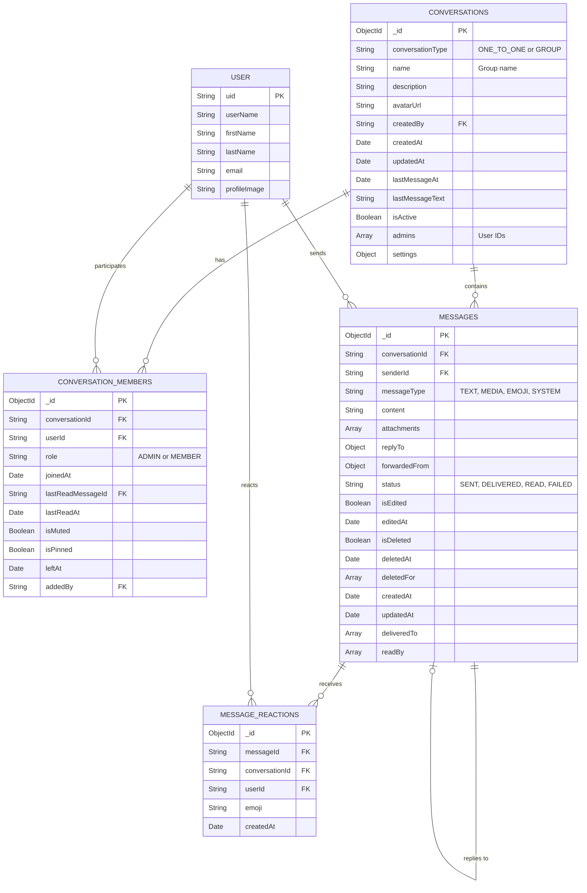
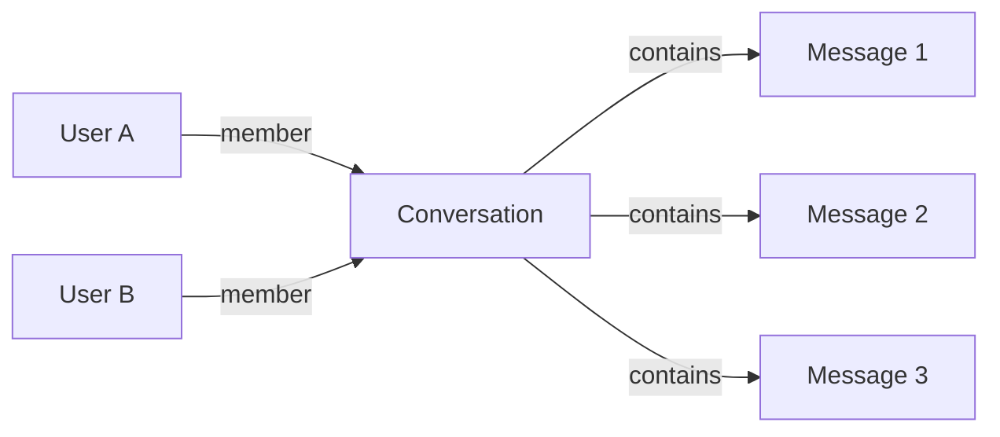
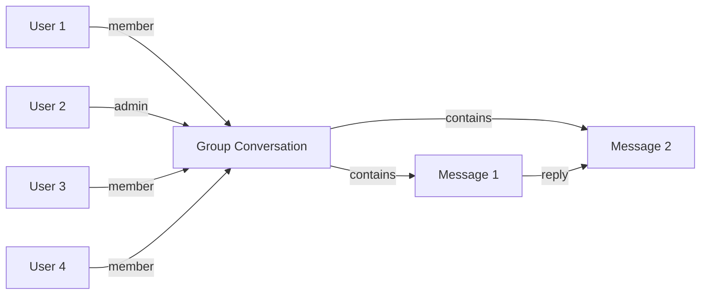
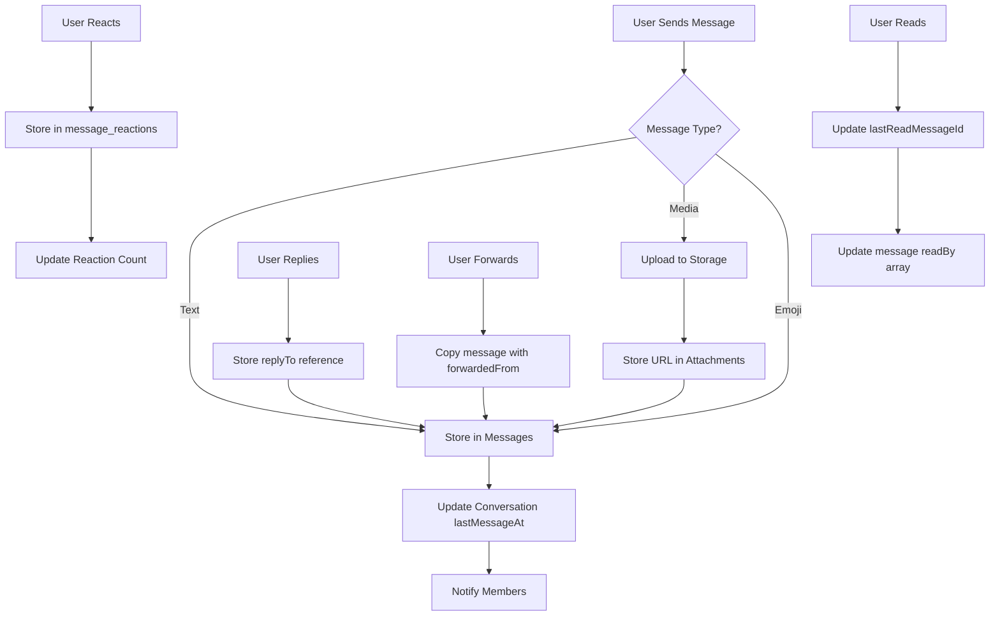
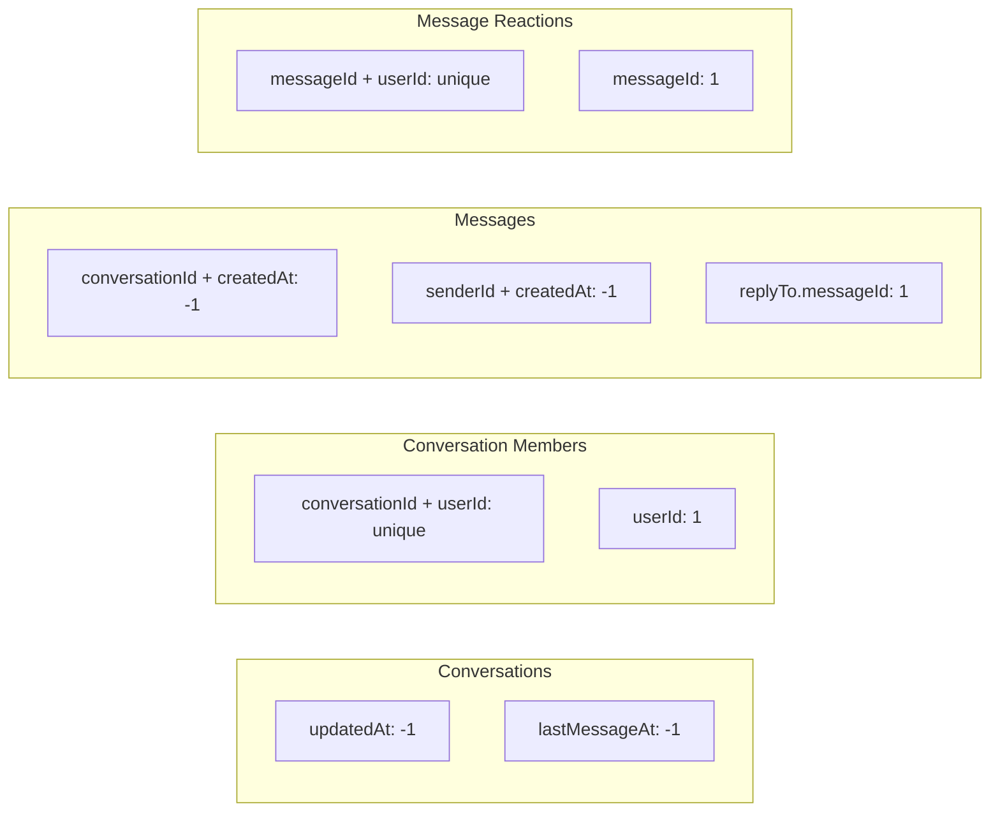

# Messaging App Data Model

## Entity Relationship Diagram

## Collection Relationships

### One-to-One Conversation

### Group Conversation

## Message Flow with Features

## Data Access Patterns

```mermaid
graph TB
    subgraph "Get User Conversations"
    A1[Query conversation_members by userId] --> A2[Get conversation details]
    A2 --> A3[Sort by lastMessageAt]
    A3 --> A4[Calculate unread count]
    end
    
    subgraph "Get Conversation Messages"
    B1[Query messages by conversationId] --> B2[Sort by createdAt DESC]
    B2 --> B3[Paginate results]
    B3 --> B4[Load reactions for each message]
    end
    
    subgraph "Send Message"
    C1[Insert message] --> C2[Update conversation lastMessage]
    C2 --> C3[Push notification to members]
    C3 --> C4[WebSocket broadcast]
    end
```

## Indexes Strategy

